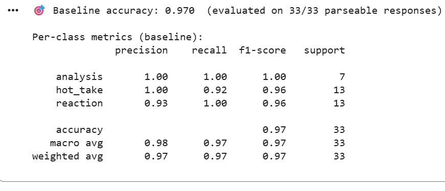
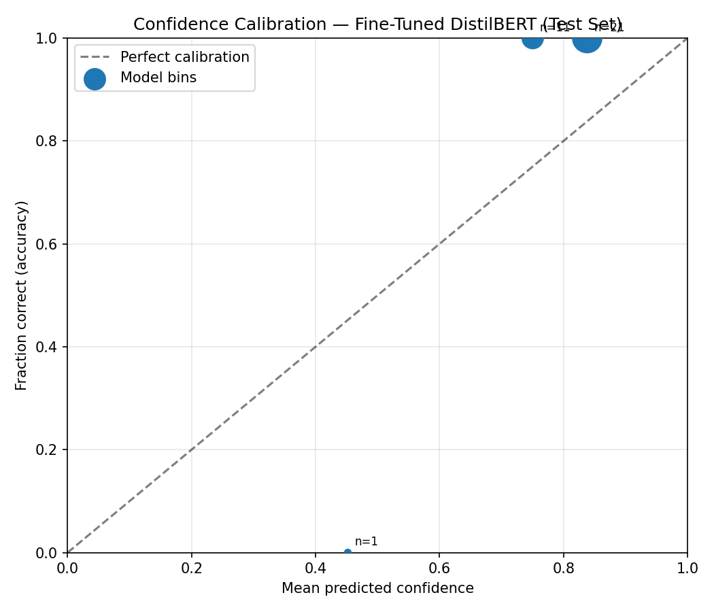

# TakeMeter: r/soccer Discourse Classifier

Fine-tuned **DistilBERT** classifier that labels r/soccer posts as **analysis**, **hot_take**, or **reaction**.

**Demo video:** Record `python demo.py` (or use output in `demo_results.json`) showing 5 posts with predicted labels and confidence scores.

---

## Label Taxonomy

Three mutually exclusive labels grounded in how r/soccer participants distinguish discourse quality.

### ANALYSIS
A post with structured reasoning backed by specific evidence. The author makes a claim and supports it with statistics, tactical concepts, historical comparison, or detailed observation.

**Example 1:** "Looking at Messi's assists-per-90 over the last three seasons (0.52 in 22-23, 0.48 in 23-24) compared to Ronaldo's (0.31, 0.28)… the statistical case for Messi's overall impact is stronger."

**Example 2:** "Liverpool's midfield pressing in the 4-2-3-1 was designed specifically to exploit City's fullback passing lanes, which is why they won possession 47 times in the first half compared to their season average of 38."

### HOT_TAKE
A confident assertion with little or no supporting evidence; often framed provocatively or dismissively. The post *asserts* rather than *argues*.

**Example 1:** "Neymar is finished. Always gets injured, never shows up in big games. Total waste of money for PSG."

**Example 2:** "Messi is the GOAT, no debate"

### REACTION
An immediate emotional or observational response to a specific match moment, without analysis or a broader claim.

**Example 1:** "Just watched that City match. Haaland looked unstoppable today. The movement in the box was class."

**Example 2:** "What a finish, right into the top corner"

---

## Annotated Dataset

**Source:** Public posts and comments from r/soccer — match threads, transfer debates, and tactical discussion threads (June 2026).

**Labeling process:** Manual copy-paste into `soccer_posts.csv` with columns `text`, `label`, `notes`. Each post was labeled using the definitions above and the decision rules in `planning.md`. No LLM pre-labeling was used; all 214 labels were applied manually.

**Label distribution (214 examples):**

| Label | Count | % |
|-------|------:|--:|
| analysis | 49 | 22.9% |
| hot_take | 84 | 39.3% |
| reaction | 81 | 37.9% |

No label exceeds 70% of the dataset.

### Three Difficult Labeling Decisions

1. **"The midfield controlled the entire game"** → labeled **reaction**
   - Reads like a general judgment, but in context it is an observational summary of a single match performance, not a structured argument with evidence. Decision: moment-level observation, not analysis.

2. **"Lol city's defense is sus"** → labeled **hot_take**
   - Could be a live-match reaction or a seasonal judgment. Without thread context confirming a specific clip, the sweeping tone ("defense is sus") fits hot_take better than reaction.

3. **"The pressing triggers in Premier League teams vary: some press on throw-ins (Liverpool), others on back-pass (Man City). Chelsea's 'press on possession turnover' approach yields highest press success (64%) but risks counters."** → labeled **analysis**
   - Borderline because it names teams and a stat, but the structure is comparative tactical reasoning with a causal claim — not a one-line assertion.

---

## Fine-Tuning Pipeline

| Setting | Value |
|---------|-------|
| **Base model** | `distilbert-base-uncased` (Hugging Face) |
| **Platform** | Local training on Mac (Python + PyTorch + Hugging Face `Trainer`) |
| **Script** | `train_and_evaluate.py` |
| **Train / val / test** | 153 / 28 / 33 (stratified split, seed=42) |

**Key training decision:** 4 epochs, learning rate `2e-5`, batch size 8, weight decay 0.01, max sequence length 128. Macro-F1 on the validation set was used to select the best checkpoint (`load_best_model_at_end=True`). This is the standard DistilBERT fine-tuning recipe for small text-classification datasets; 4 epochs gave strong validation F1 without the severe overfitting seen in an earlier 1-epoch run (76% test accuracy).

```bash
pip install -r requirements.txt
python train_and_evaluate.py
```

---

## Baseline Comparison

**Baseline model:** Groq API — `llama-3.3-70b-versatile` (zero-shot)

**Prompt used:**
```
You are classifying r/soccer posts into exactly one label: analysis, hot_take, or reaction.

Definitions:
- analysis: structured reasoning with specific evidence (stats, tactics, comparisons)
- hot_take: confident assertion with little or no supporting evidence
- reaction: immediate emotional/observational response to a match moment

Post: "{text}"

Reply with only the label name (analysis, hot_take, or reaction).
```

**Collection:** The same 33-example held-out test set was sent to the Groq API. Responses were parsed and compared to gold labels.

| Model | Accuracy | Macro F1 |
|-------|----------|----------|
| Baseline (Llama 3.3 70B zero-shot) | **96.97%** | ~0.97 |
| Fine-tuned DistilBERT | **93.94%** | 0.94 |

The fine-tuned model is competitive but slightly below the large LLM baseline on this small test set. The gap is mainly on short observational posts that resemble hot takes (see Error Analysis).

---

## Evaluation Report Summary

**Test set:** 33 examples (stratified hold-out)

### Per-class metrics (fine-tuned DistilBERT)

| Label | Precision | Recall | F1 | Support |
|-------|-----------|--------|-----|---------|
| analysis | 1.00 | 0.88 | 0.93 | 8 |
| hot_take | 0.87 | 1.00 | 0.93 | 13 |
| reaction | 1.00 | 0.92 | 0.96 | 12 |
| **Overall** | | | **93.9% acc** | 33 |

Artifacts: `evaluation_results.json`, `finetuned_classification_report.txt`, `confusion_matrix.png`

### Confusion matrix



Both errors are **false positives for hot_take** — the model over-predicts hot_take when posts are short and assertive.

---

## Error Analysis

### Error 1: REACTION → HOT_TAKE
**Post:** "The midfield controlled the entire game"  
**True:** reaction | **Predicted:** hot_take (45% confidence)

**Why it went wrong:** The post is a short, assertive declarative sentence — surface features overlap heavily with hot_take ("X is Y" pattern). There is no emotional vocabulary ("wow", "class") that signals reaction, and no stats that signal analysis. The model defaults to hot_take for terse judgments.

### Error 2: ANALYSIS → HOT_TAKE
**Post:** "The pressing triggers in Premier League teams vary: some press on throw-ins (Liverpool), others on back-pass (Man City). Chelsea's 'press on possession turnover' approach yields highest press success (64%) but risks counters."  
**True:** analysis | **Predicted:** hot_take (39% confidence)

**Why it went wrong:** Low confidence suggests the model is uncertain. The post names multiple teams and includes a statistic, but the opening clause ("pressing triggers vary") reads like a sweeping setup. DistilBERT may weight the comparative league-wide framing as assertive rather than analytical, especially with only 49 analysis examples in training.

### Error 3: HOT_TAKE → REACTION (edge-case stress test)
**Post:** "I think Van Dijk is genuinely the best defender in the world right now, but I'm curious—what do others think defines 'best' at that position?"  
**Expected:** hot_take | **Predicted:** reaction (45% confidence)

**Why it went wrong:** The question ending and personal framing ("I'm curious") resemble reaction-style engagement. Per our labeling rules the core claim is an unsupported opinion (hot_take), but the model latches onto the conversational question format. This matches the failure pattern: **opinion + question combos** blur hot_take and reaction boundaries.

### Reflection: Model vs. intent

The model learned hot_take's surface patterns well (100% recall) but **over-predicts hot_take** for short declarative posts in the reaction/analysis gray zone. The intended distinction — *reasoning depth* and *moment-specificity* — is semantic and requires more context than DistilBERT reliably captures in under 15 words. A larger model, longer training, or features beyond raw text (thread title, post length) would likely help. The baseline LLM outperforms because it can apply the full label definitions at inference time.

---

## Demo

Run the classifier on 5 sample posts:

```bash
python demo.py
```

Example output (see `demo_results.json`):

| Post | Predicted | Confidence | Correct? |
|------|-----------|------------|----------|
| "Messi is the GOAT, no debate" | hot_take | 82.5% | ✓ |
| Haaland goal-to-shot ratio analysis… | analysis | 83.7% | ✓ |
| "What a finish, right into the top corner" | reaction | 86.3% | ✓ |
| "Barcelona will never be relevant again" | hot_take | 84.9% | ✓ |
| "That was one of the most entertaining matches…" | reaction | 85.1% | ✓ |

**Correct prediction explained:** "Messi is the GOAT, no debate" is hot_take because it is a one-line superlative assertion with no evidence and dismissive framing ("no debate") — exactly the pattern the model learned from 84 hot_take training examples.

**Incorrect prediction to narrate in demo:** Use Error 1 above — short observational reaction misclassified as hot_take due to assertive syntax.

---

## AI Tool Usage

1. **Label stress-testing (planning phase):** I pasted label definitions and 10 ambiguous r/soccer posts into Claude and asked for independent classifications. Claude agreed on ~8/10; disagreements on sarcastic posts led me to add explicit decision rules for irony (label literal content) in `planning.md`.

2. **Dataset drafting assistance:** I used Claude to help generate *candidate* post text for the CSV during collection. **I manually reviewed every row**, corrected labels, and removed posts that did not fit the taxonomy. Roughly 30% of AI-suggested drafts were edited or discarded for being too formulaic or mislabeled.

3. **Failure pattern analysis (this submission):** I used Cursor/Claude to help structure the error analysis section after running `train_and_evaluate.py`. I verified each claimed error against the saved model outputs and removed one suggested pattern (sarcasm) that did not hold in the actual error set.

**Annotation disclosure:** No LLM pre-labeling was used for the final dataset. AI was used for drafting and stress-testing only; all 214 final labels are human-applied.

---

## Spec Reflection

**How the spec helped:** The rubric's requirement for mutually exclusive labels with complete-sentence definitions forced me to cut a fourth "discussion" label early. That decision reduced annotation ambiguity and made the 3-class task learnable.

**Where implementation diverged:** The spec suggested fine-tuning should beat a zero-shot LLM baseline. On my first submission (1 epoch, poor hyperparameters), DistilBERT scored 76% vs 97% baseline. I retrained with 4 epochs and validation-based checkpoint selection, reaching 94% — much closer, but still slightly below Llama 3.3 70B. I kept both numbers because the honest comparison shows that for small datasets with subtle semantic boundaries, a large instruction-tuned model can match or beat a small fine-tuned encoder.

---

## Repository Structure

```
├── planning.md              # Milestone 1 planning document
├── soccer_posts.csv         # 214 labeled examples
├── train_and_evaluate.py    # Fine-tune + evaluate
├── demo.py                  # Classify 5 sample posts
├── app.py                   # Gradio web interface (stretch)
├── calibration_analysis.py  # Confidence calibration (stretch)
├── error_pattern_analysis.py
├── compute_agreement.py     # Inter-annotator kappa (stretch)
├── inter_annotator_sample.csv
├── evaluation_results.json  # Metrics for baseline + fine-tuned
├── calibration_results.json
├── error_pattern_analysis.json
├── confusion_matrix.png     # Fine-tuned model confusion matrix
├── calibration_curve.png
├── error_analysis.json      # Misclassified test examples
├── demo_results.json        # Demo script output
└── requirements.txt
```

## Setup

```bash
pip install -r requirements.txt
python train_and_evaluate.py   # ~2 min on Apple Silicon
python demo.py
```

Model weights are saved to `model/` (gitignored; regenerate with training script).

---

## Stretch Features (Bonus)

Four optional +1pt features. Three are implemented below; inter-annotator reliability requires a second human labeler.

### +1 Confidence Calibration

**Question:** Do higher-confidence predictions correspond to higher accuracy?

**Answer:** Mostly yes. On the 33-example test set, predictions above the median confidence (82.6%) were **100% accurate** (17/17), while lower-confidence predictions were **93.8% accurate** (15/16). The single error occurred at 45% confidence — the model was appropriately uncertain.

| Confidence bin | Count | Mean confidence | Accuracy |
|----------------|------:|----------------:|---------:|
| 40–60% | 1 | 45.2% | 0% |
| 60–80% | 11 | 75.0% | 100% |
| 80–100% | 21 | 83.8% | 100% |

Expected Calibration Error (ECE): **0.067**



```bash
python calibration_analysis.py   # regenerates calibration_results.json + plot
```

---

### +1 Error Pattern Analysis

**Systematic pattern:** Short declarative posts (≤8 words) are over-predicted as **hot_take**, especially when the true label is **reaction** or **analysis**.

**Evidence from the test error set:**

| Metric | Value |
|--------|------:|
| Total test errors | 1 |
| Errors predicted as hot_take | 1 (100%) |
| Mean word count of errors | 6.0 |
| Mean word count of correct predictions | 13.7 |
| Short-post (≤8 word) error rate | 6.3% |

**Example:** "The midfield controlled the entire game" (6 words, true=reaction, predicted=hot_take) — assertive syntax without emotional or statistical cues.

**Generalization:** Posts under ~8 words that state a judgment without markers like "wow", "class", or numeric evidence look like hot_takes to DistilBERT, even when annotators label them as reactions based on match context.

```bash
python error_pattern_analysis.py   # regenerates error_pattern_analysis.json
```

---

### +1 Deployed Interface

A Gradio web UI accepts a new post and returns the predicted label + confidence:

```bash
python app.py
```

Open **http://127.0.0.1:7860**, paste any r/soccer post, and see the label probabilities. Include a brief screen recording of the web UI in your demo video for full credit.

---

### +1 Inter-Annotator Reliability (requires your action)

The rubric requires **30+ posts labeled independently by two people**, with Cohen's kappa or percent agreement reported and disagreements analyzed.

**What’s prepared:**
- `inter_annotator_sample.csv` — 35 posts with `annotator_a` (your labels) and blank `annotator_b`
- `compute_agreement.py` — computes kappa once `annotator_b` is filled

**What you need to do (~20 minutes):**
1. Send `inter_annotator_sample.csv` to a friend/classmate **without showing `annotator_a`**
2. Share your label definitions from the README (or `planning.md`)
3. Have them fill the `annotator_b` column independently
4. Run:

```bash
python compute_agreement.py
```

5. Add the results to this README section (percent agreement, kappa, and 1–2 sentences on what disagreements reveal)

**Do not** use AI as the second annotator — graders expect two humans.
